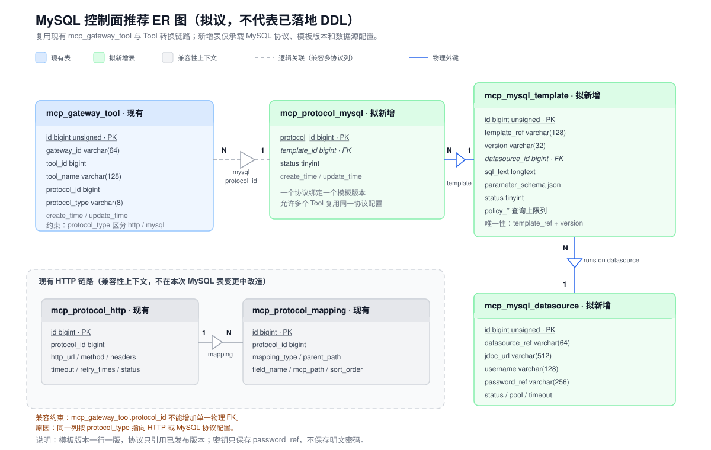

# MySQL 控制面持久化方案与 ER 决策输入

## 当前边界

本记录只讨论控制面持久化的候选方案，不执行 DDL、DAO、PO、Mapper 或迁移。当前运行链路仍由配置和内存 Registry 提供模板、数据源和策略，`9.1` 只有在 Xerina 确认后才能实施。

现有 `mcp_gateway_tool` 同时承载 HTTP 与未来 MySQL Tool 绑定，`protocol_id` 是按 `protocol_type` 解释的多协议列。新增 MySQL 表不能破坏现有 HTTP 的 `mcp_protocol_http` 与 `mcp_protocol_mapping` 链路，也不能要求重写现有 Tool 转换流程。

推荐方案的 ER 图：

## 方案 A：最小增量、复用现有 Tool 绑定（推荐）

新增三张表：

| 表 | 业务职责 | 关键字段语义 |
| --- | --- | --- |
| `mcp_protocol_mysql` | 将现有 Tool 的 MySQL 协议绑定到一个模板版本 | `protocol_id`、`template_id`、`status` |
| `mcp_mysql_template` | 保存一个可发布的模板版本及参数 Schema | `template_ref`、`version`、`sql_text`、`parameter_schema`、`datasource_id`、查询上限策略 |
| `mcp_mysql_datasource` | 保存目标库连接元数据和运行边界 | `datasource_ref`、`jdbc_url`、`username`、`password_ref`、连接池/超时/状态 |

关系为：`datasource 1:N template`、`template 1:N protocol_mysql`，现有 `mcp_gateway_tool` 通过 `protocol_type=mysql + protocol_id` 逻辑关联 `mcp_protocol_mysql`。模板和数据源之间、协议和模板之间可以使用物理外键；多协议 `mcp_gateway_tool.protocol_id` 不增加单一物理外键，以保持 HTTP 兼容。

策略先作为模板和数据源的列保存，领域层继续执行“模板策略 ∩ 数据源策略 ∩ 调用方收紧策略”的合并规则。只有当策略需要独立审批、继承或审计时，才拆表。

优点：

- 改动最小，直接复用现有 `ToolsListHandler`、`ToolsCallHandler`、`ToolExecutorRouter` 和 MySQL 模板执行器；
- 模板版本天然可回滚，已发布版本不会被覆盖；
- 数据源密钥仍只保存引用，不把密码放进控制库；
- 表数量与当前 MVP 的三个核心聚合一致，便于先实现真实 MySQL 读路径。

代价：

- 参数定义放在 JSON 中，按参数维度检索和审计能力有限；
- 策略字段需要在模板和数据源表中各维护一份，后续若出现更多策略类型可能需要再抽象。

## 方案 B：完全规范化的模板版本、参数和策略模型

在方案 A 的基础上拆出：

- `mcp_mysql_template`：模板业务身份；
- `mcp_mysql_template_version`：SQL、发布状态、版本内容；
- `mcp_mysql_template_parameter`：每个参数一行，保存类型、必填、描述和顺序；
- `mcp_mysql_query_policy`：按 `DATASOURCE`、`TEMPLATE`、未来 `TOOL` 作用域保存策略；
- `mcp_protocol_mysql`、`mcp_mysql_datasource`：保留方案 A 的绑定关系。

优点是字段约束、参数检索、版本审计和策略治理最完整，适合多团队管理、审批流和字段级权限。

代价是一次引入五张以上新表，需要事务化发布、版本快照、级联删除和更多 Repository/Mapper；当前 Domain 已经以聚合对象承载模板参数和策略，直接落地会把持久化结构反过来主导领域模型，超出本次 MVP 的最小增量目标。

## 方案 C：单表 JSON 聚合

只新增一张 `mcp_mysql_backend`，将数据源、模板、参数和策略放入 JSON 列，`mcp_gateway_tool` 通过 `backend_id` 关联。

优点是迁移最快、表最少、早期字段变化成本低。

代价是数据库无法有效约束模板版本、状态和数据源唯一性，发布/回滚容易覆盖数据；按参数或策略审计需要在应用层解析 JSON，故障排查和索引能力弱，也更容易把敏感连接信息误写入聚合 JSON。该方案不符合当前控制面需要的可审计和可回滚要求，不推荐。

## 选择结论

Xerina 已选择方案 A，作为下一独立变更的初始持久化模型，理由是：

1. 它保留现有 Gateway 的多协议 Tool 绑定和 HTTP 兼容，不重复建设转换链路；
2. 三张表分别对应数据源、模板版本、协议绑定三个清晰职责，满足 Domain 聚合边界；
3. 只在同类型表之间建立物理外键，跨 `protocol_type` 的旧列保持逻辑关联，避免破坏现有数据；
4. 策略先内聚于模板/数据源，等出现独立审批或继承需求再演进为方案 B；
5. 可按“先只读查询、再管理 API、最后迁移旧配置”的增量顺序实施。

## 9.1 任务拆分与当前状态

方案 A 的选择已经完成，但 9.1 还需要把可实施的表结构和迁移边界逐项确认。当前拆分如下：

- [x] 9.1.a 确定持久化方向：采用方案 A，不重写现有 Tool 转换和 HTTP 链路。
- [x] 9.1.b 确定核心对象：数据源、模板版本、MySQL 协议绑定分别对应三张表。
- [x] 9.1.c 确定关系边界：新表之间使用物理外键，`mcp_gateway_tool.protocol_id` 保持按 `protocol_type` 解释的逻辑关联。
- [x] 9.1.d 确定 ER 图和候选字段语义：主键、外键、唯一键、版本、状态、参数 Schema 和密钥引用均已形成候选设计。
- [ ] 9.1.e 确认最终字段清单、字段类型、长度、默认值、索引和空值规则。
- [ ] 9.1.f 确认发布、停用、删除、回滚、密钥轮换和失效语义。
- [ ] 9.1.g 确认从当前配置/内存 Registry 到控制库的迁移顺序、兼容窗口、回滚步骤和真实 MySQL 验证方案。
- [ ] 9.1.h Xerina 确认上述内容后，形成最终表结构决策记录，才允许进入 DDL、DAO、PO、Mapper 和 Repository 实施。

因此，当前 OpenSpec 的 `9.1` 仍保持未完成；它不是因为方案未选择，而是因为实施所需的字段和迁移约束还没有全部落定。

## 需要 Xerina 最终确认的事项

在把 `9.1` 标记为完成前，请确认以下决策：

- 是否采用方案 A，以及三张表的最终表名；
- `mcp_gateway_tool.protocol_id` 是否继续作为按 `protocol_type` 解释的逻辑关联；
- 模板版本是否采用“每个版本一行、已发布版本不可覆盖”；
- `parameter_schema` 是否暂时使用 JSON，还是本期直接采用方案 B 的参数明细表；
- 数据源只保存 `password_ref` 等密钥引用，是否禁止保存明文密码；
- 模板、数据源和协议绑定的删除、停用、发布、回滚和迁移兼容策略；
- 已有 HTTP 表是否只读保留，不做字段或外键改造。
